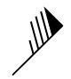

<a href="http://www.wtfpl.net/"></a>

[](https://GitHub.com/ilsanchez/d3-wind-barbs/graphs/commit-activity)
[](https://github.com/ilsanchez/d3-wind-barbs/blob/master/LICENSE)
[](https://github.com/ilsanchez/d3-wind-barbs)
[](https://github.com/ellerbrock/open-source-badges/)
[](https://bundlephobia.com/result?p=d3-wind-barbs@1.0.3)

# d3-wind-barbs



Generates wind barbs for your meteorological visualizations in a dead simple way.

This library is fully customizable, from colors to bars and triangle angle.

## How to use?

```bash
npm install --save d3-wind-barbs
```

```typescript
const windBarb = new D3WindBarb(
  40 /* wind speed in knots */,
  135 /* wind direction angle */
).draw();
```

Click [here](https://ilsanchez.github.io/d3-wind-barbs/) to see the full documentation.

Or [here](https://stackblitz.com/edit/d3-wind-barbs-playground?file=index.tsx) to play with it in Stackblitz
